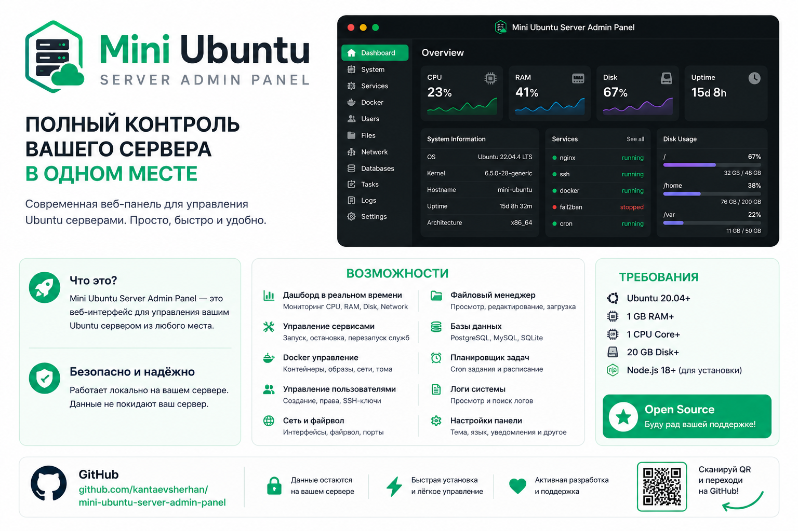

# Mini Ubuntu Server Panel

Web-панель управления Ubuntu Server с backend на Go/Fiber и frontend на Vue 3. Поддерживает Ubuntu `amd64`/`arm64`, устанавливается из GitHub Releases и запускается как `mini-ubuntu-server.service`.

> Проект находится в активной разработке. Для production используйте TLS reverse proxy, VPN/IP allowlist и рекомендации из [production deployment](docs/production.md).

## Возможности

- Dashboard с текущими и историческими CPU/RAM-метриками из `/proc`;
- процессы Linux и allowlisted сигналы;
- systemd services и защищённый собственный unit;
- Docker containers через Moby SDK с явным opt-in к socket;
- UFW rules с защитой SSH-порта;
- bounded journald viewer;
- файловый менеджер только внутри `allowed_directories` и Monaco Editor;
- непривилегированный web-terminal с одноразовым WebSocket ticket;
- отдельные panel users и Ubuntu users с compensating rollback;
- Telegram recipients, правила, cooldown/recovery и durable delivery queue;
- Audit и Notifications pages;
- встроенные CLI-команды update/uninstall с backup и rollback.

Системные изменения выполняются без произвольного shell: backend передаёт строго валидированный JSON через stdin точным root-helper subcommands. Секреты, terminal input и Ubuntu passwords не записываются в SQLite или audit.

## Имена проекта

| Назначение | Имя |
|---|---|
| GitHub repository | `mini-ubuntu-server-panel` |
| CLI и binary | `mini-ubuntu-server` |
| systemd service | `mini-ubuntu-server.service` |

Repository: <https://github.com/kantaevsherhan/mini-ubuntu-server-panel>

## Стек

Backend:

- Go 1.25, Fiber 2, REST/WebSocket;
- GORM и pure-Go SQLite;
- JWT, bcrypt, Docker SDK;
- `/proc`, `/sys`, systemd, UFW и exact sudoers helpers.

Frontend:

- Vue 3, Vite, TypeScript, Vue Router, Pinia;
- PrimeVue 4, PrimeIcons и `@primeuix/themes` Aura/Lara;
- Tailwind CSS для layout/utilities;
- Moment.js, ECharts, xterm.js и Monaco Editor;
- Bun для dependencies, scripts и build.

Интерфейс использует готовые PrimeVue-компоненты. По умолчанию активны Aura, dark mode и emerald accent; доступны Lara, light mode, blue/violet accents и только два языка — русский и английский. Даты форматируются общим Moment.js service: `DD.MM.YYYY HH:mm` для RU и `MM/DD/YYYY h:mm A` для EN.

## Быстрый запуск для разработки

Требуются Go 1.25+ и Bun 1.3+.

Frontend:

```bash
cd frontend
bun install
bun run dev
```

Backend в другом terminal:

```bash
export MINI_UBUNTU_SERVER_JWT_SECRET="$(openssl rand -hex 32)"
export MINI_UBUNTU_SERVER_BOOTSTRAP_USERNAME=admin
export MINI_UBUNTU_SERVER_BOOTSTRAP_PASSWORD='change-this-long-password'
cd backend
go run ./cmd/mini-ubuntu-server --config ../packaging/config.example.yml
```

Vite работает на `http://localhost:5173`, проксирует REST и WebSocket к `127.0.0.1:8080`. Bootstrap admin создаётся только для пустой базы; plaintext password не логируется.

Production build со встроенным frontend:

```bash
make build VERSION=v0.1.0
```

## Проверки

```bash
cd frontend
bun run format
bun run check
bun audit
bun run e2e

cd ../backend
gofmt -w .
go test ./...
go vet ./...
golangci-lint run
govulncheck ./...

cd ..
bash -n scripts/*.sh
```

`make check` выполняет frontend check, gofmt verification, Go tests/vet/lint и shell syntax. CI дополнительно запускает `bun audit`, desktop/mobile Playwright и `govulncheck`.

## Установка

Одна команда:

```bash
curl -fsSL https://raw.githubusercontent.com/kantaevsherhan/mini-ubuntu-server-panel/main/scripts/install.sh | sudo bash
```

Определённая версия:

```bash
curl -fsSL https://raw.githubusercontent.com/kantaevsherhan/mini-ubuntu-server-panel/main/scripts/install.sh \
  | sudo bash -s -- --version v1.0.0
```

Безопасный вариант с просмотром:

```bash
curl -fsSL https://raw.githubusercontent.com/kantaevsherhan/mini-ubuntu-server-panel/main/scripts/install.sh -o install.sh
less install.sh
sudo bash install.sh
rm install.sh
```

Параметры локального файла:

```bash
sudo bash install.sh --port 8080 --username admin --data-dir /var/lib/mini-ubuntu-server
sudo bash install.sh --enable-docker
```

`--enable-docker` добавляет service user в существующую группу `docker`. Это root-equivalent доступ и он по умолчанию выключен.

Installer проверяет Ubuntu/architecture/SHA-256, создаёт пользователя, config, secrets, SQLite, sudoers и systemd unit. Временный admin password показывается один раз и удаляется из environment file после успешного health-check; остаётся только bcrypt hash.

## Управление

```bash
sudo systemctl status mini-ubuntu-server
sudo systemctl restart mini-ubuntu-server
sudo journalctl -u mini-ubuntu-server -f

sudo mini-ubuntu-server update
sudo mini-ubuntu-server update --version v1.1.0
sudo mini-ubuntu-server uninstall
```

Основные пути:

- `/opt/mini-ubuntu-server/bin/mini-ubuntu-server`;
- `/etc/mini-ubuntu-server/{config.yml,secrets.env}`;
- `/var/lib/mini-ubuntu-server/mini-ubuntu-server.db`;
- `/var/lib/mini-ubuntu-server/backups`;
- `/var/log/mini-ubuntu-server`.

Все distribution scripts находятся только в `scripts/`: `install.sh`, `update.sh`, `uninstall.sh`, `release.sh`.

## Документация

- [Индекс документации](docs/README.md)
- [Архитектура](docs/architecture.md)
- [Backend и API](docs/backend.md)
- [Frontend](docs/frontend.md)
- [Безопасность](docs/security.md)
- [Production deployment](docs/production.md)
- [Эксплуатация](docs/operations.md)
- [План расширения](docs/expansion-plan.md)

## Лицензия

Лицензия пока не выбрана. До появления файла `LICENSE` стандартное авторское право сохраняется, и repository нельзя считать open-source лицензированным.
