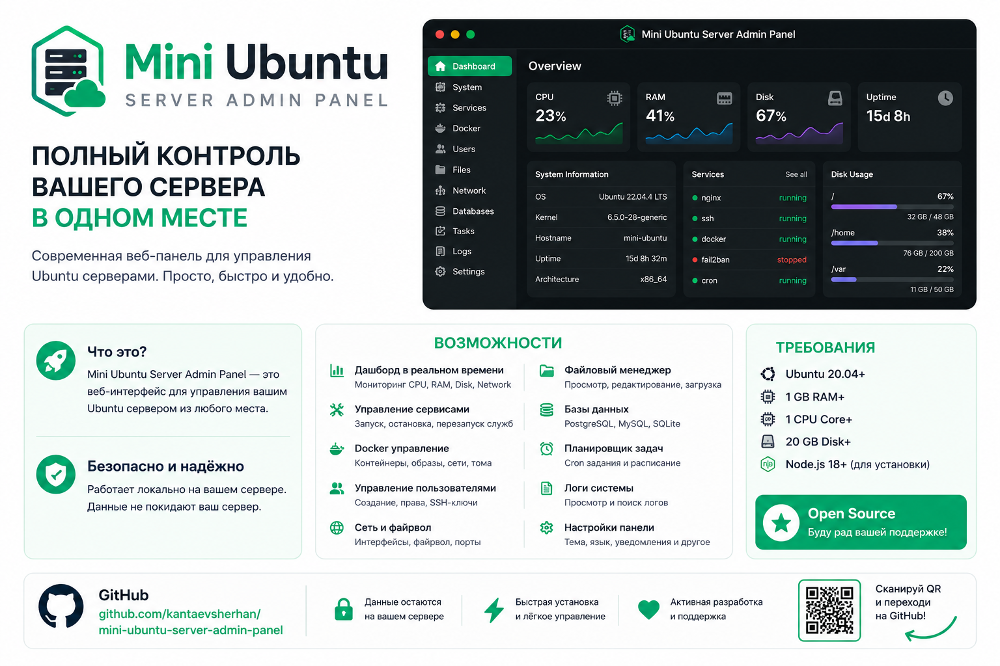

# Mini Ubuntu Server Panel - by sherhan

Web-панель управления Ubuntu Server с backend на Go/Fiber и frontend на Vue 3. Поддерживает Ubuntu `amd64`/`arm64`, устанавливается из GitHub Releases и запускается как `mini-ubuntu-server.service`.

> Проект находится в активной разработке. Для production используйте TLS reverse proxy, VPN/IP allowlist и рекомендации из [production deployment](docs/production.md).

## Возможности

- Dashboard: CPU/RAM/диск, аптайм, load average, признаки «нужна перезагрузка» и доступных обновлений apt, история метрик;
- процессы Linux и allowlisted сигналы;
- systemd services и защищённый собственный unit;
- Docker через Moby SDK с явным opt-in к socket: контейнеры (start/stop/restart/pause/kill/remove, логи, запуск нового контейнера с портами, env, томами и restart policy), образы (фоновый pull, удаление), тома, сети и очистка (prune);
- страница «Система»: ОС, ядро, CPU/load, память/swap, диски, сетевые интерфейсы и слушающие порты с переходом к открытию порта в UFW;
- UFW rules с защитой SSH-порта;
- bounded journald viewer;
- файловый менеджер только внутри `allowed_directories` и Monaco Editor;
- непривилегированный web-terminal: до 8 вкладок, сессии продолжают работать на сервере после закрытия браузера и восстанавливаются с историей вывода (закрываются только вручную или при перезапуске сервиса);
- отдельные panel users и Ubuntu users с compensating rollback;
- мониторинг с Telegram-уведомлениями: упавшие/unhealthy/перезапускающиеся Docker-контейнеры, failed и выбранные остановленные systemd-сервисы, CPU/RAM/swap/диски по порогам, вход администратора и изменения firewall; уведомления «восстановлено», отдельное состояние для каждого контейнера/сервиса/диска, настраиваемые интервал, пороги, исключения и получатели для каждого правила;
- Audit и Notifications pages;
- встроенные CLI-команды update/uninstall с backup и rollback;
- автообновление страниц только пока вкладка видна (пауза в фоне), кэш тяжёлых `/proc`-сканов.

Системные изменения выполняются без произвольного shell: backend передаёт строго валидированный JSON через stdin точным root-helper subcommands. Секреты, terminal input и Ubuntu passwords не записываются в SQLite или audit.

## Имена проекта

| Назначение | Имя |
|---|---|
| GitHub repository | `mini-ubuntu-server-panel` |
| CLI и binary | `mini-ubuntu-server` |
| systemd service | `mini-ubuntu-server.service` |

Repository: <https://github.com/kantaevsherhan/mini-ubuntu-server-panel>

## Стек

Backend:

- Go 1.25, Fiber 2, REST/WebSocket;
- GORM и pure-Go SQLite;
- JWT, bcrypt, Docker SDK;
- `/proc`, `/sys`, systemd, UFW и exact sudoers helpers.

Frontend:

- Vue 3, Vite, TypeScript, Vue Router, Pinia;
- PrimeVue 4, PrimeIcons и `@primeuix/themes` Aura/Lara;
- Tailwind CSS для layout/utilities;
- Moment.js, ECharts, xterm.js и Monaco Editor;
- Bun для dependencies, scripts и build.

Интерфейс использует готовые PrimeVue-компоненты. По умолчанию активны Aura, dark mode и emerald accent; доступны Lara, light mode, blue/violet accents и только два языка — русский и английский. Даты форматируются общим Moment.js service: `DD.MM.YYYY HH:mm` для RU и `MM/DD/YYYY h:mm A` для EN.

## Быстрый запуск за одну команду

Нужен только Docker. Ни Go, ни Bun, ни ручных миграций: схема SQLite применяется при старте, JWT-секрет и временный администратор создаются автоматически.

```bash
docker compose up -d --build
docker compose logs panel | grep "temporary password"
```

Откройте <http://localhost:8080> и войдите под `admin` с паролем из лога — панель сразу попросит его сменить. Данные лежат в томе `panel-data`, поэтому пароль и сессии переживают `docker compose restart`.

```bash
docker compose down      # остановить, данные сохранятся
docker compose down -v   # остановить и стереть базу, начать с нуля
```

Страницы Docker, systemd, UFW и journald внутри контейнера ожидаемо отвечают «сервис недоступен»: у контейнера нет доступа к хосту. Чтобы включить управление контейнерами, раскомментируйте проброс `/var/run/docker.sock` в `docker-compose.yml` (это root-equivalent доступ). Полный доступ ко всем возможностям даёт установка на Ubuntu из раздела [Установка](#установка).

## Запуск для разработки

Требуются Go 1.25+, Bun 1.3+ и Node.js (его требует `vue-tsc`).

Frontend:

```bash
cd frontend
bun install
bun run dev
```

Backend в другом terminal:

```bash
cd backend
go run ./cmd/mini-ubuntu-server --config ../packaging/config.example.yml
```

Vite работает на `http://localhost:5173`, проксирует REST и WebSocket к `127.0.0.1:8080`. Для пустой базы создаётся администратор `admin`, его временный пароль печатается в лог один раз. Переопределить можно переменными `MINI_UBUNTU_SERVER_BOOTSTRAP_USERNAME`, `MINI_UBUNTU_SERVER_BOOTSTRAP_PASSWORD` и `MINI_UBUNTU_SERVER_JWT_SECRET`; без последней секрет генерируется и хранится в `data_dir/jwt.key`.

Production build со встроенным frontend:

```bash
make build VERSION=v0.1.0
```

## Проверки

```bash
cd frontend
bun run format
bun run check
bun audit
bun run e2e

cd ../backend
gofmt -w .
go test ./...
go vet ./...
golangci-lint run
govulncheck ./...

cd ..
bash -n scripts/*.sh
```

`make check` выполняет frontend check, gofmt verification, Go tests/vet/lint и shell syntax. CI дополнительно запускает `bun audit`, desktop/mobile Playwright и `govulncheck`.

## Установка

Одна команда:

```bash
curl -fsSL https://raw.githubusercontent.com/kantaevsherhan/mini-ubuntu-server-panel/main/scripts/install.sh | sudo bash
```

Определённая версия:

```bash
curl -fsSL https://raw.githubusercontent.com/kantaevsherhan/mini-ubuntu-server-panel/main/scripts/install.sh \
  | sudo bash -s -- --version v1.0.0
```

Безопасный вариант с просмотром:

```bash
curl -fsSL https://raw.githubusercontent.com/kantaevsherhan/mini-ubuntu-server-panel/main/scripts/install.sh -o install.sh
less install.sh
sudo bash install.sh
rm install.sh
```

Параметры локального файла:

```bash
sudo bash install.sh --port 8080 --username admin --data-dir /var/lib/mini-ubuntu-server
sudo bash install.sh --enable-docker
```

`--enable-docker` добавляет service user в существующую группу `docker`. Это root-equivalent доступ и он по умолчанию выключен.

Installer проверяет Ubuntu/architecture/SHA-256, создаёт пользователя, config, secrets, SQLite, sudoers и systemd unit. Временный admin password показывается один раз и удаляется из environment file после успешного health-check; остаётся только bcrypt hash.

## Telegram-уведомления

1. Создайте бота у [@BotFather](https://t.me/BotFather) и отправьте своему боту `/start`.
2. **Настройки → Telegram**: вставьте Bot Token (он сохраняется root-helper в `/etc/mini-ubuntu-server/secrets.env`, не попадает в SQLite и не возвращается в браузер), включите Telegram и нажмите «Проверить подключение».
3. Добавьте получателя: ваш chat id (для личного чата совпадает с Telegram user id) или нажмите «Получить обновления» после `/start`. Отправьте тестовое сообщение.
4. **Уведомления → Мониторинг**: интервал проверки (по умолчанию 60 с), какие контейнеры не отслеживать, за какими сервисами следить, пороги ресурсов.
5. **Уведомления → Правила**: для каждого события включение, важность, cooldown, повтор, «восстановлено» и **получатели** — если получатели не выбраны, сообщение уходит всем активным получателям с включёнными алертами.

## Управление

```bash
sudo systemctl status mini-ubuntu-server
sudo systemctl restart mini-ubuntu-server
sudo journalctl -u mini-ubuntu-server -f

sudo mini-ubuntu-server update
sudo mini-ubuntu-server update --version v1.1.0
sudo mini-ubuntu-server uninstall
```

Основные пути:

- `/opt/mini-ubuntu-server/bin/mini-ubuntu-server`;
- `/etc/mini-ubuntu-server/{config.yml,secrets.env}`;
- `/var/lib/mini-ubuntu-server/mini-ubuntu-server.db`;
- `/var/lib/mini-ubuntu-server/backups`;
- `/var/log/mini-ubuntu-server`.

Все distribution scripts находятся только в `scripts/`:

| Скрипт | Назначение |
|---|---|
| `install.sh` | установка или переустановка из GitHub Release; `--update` вызывает `mini-ubuntu-server update` |
| `update.sh` | обёртка над `mini-ubuntu-server update [--version vX.Y.Z]` |
| `uninstall.sh` | обёртка над `mini-ubuntu-server uninstall` (по умолчанию данные, конфиг, бэкапы и пользователь сохраняются) |
| `release.sh` | сборка архивов amd64/arm64 с встроенным frontend и `checksums.txt` |

Повторный запуск `install.sh` сохраняет JWT secret, Telegram token, базу и пользователей; временный пароль выдаётся только при пустой базе. `update` проверяет SHA-256, делает бэкап binary, SQLite, sudoers и systemd unit, ставит sudoers/unit из релиза (с проверкой `visudo`), при неудачном health-check всё откатывает и хранит 5 последних бэкапов обновлений. Скрытые привилегированные подкоманды `privileged-*` вызываются только самой панелью через sudoers с JSON в stdin и не предназначены для ручного запуска.

## Документация

- [Индекс документации](docs/README.md)
- [Архитектура](docs/architecture.md)
- [Backend и API](docs/backend.md)
- [Frontend](docs/frontend.md)
- [Безопасность](docs/security.md)
- [Production deployment](docs/production.md)
- [Эксплуатация](docs/operations.md)
- [План расширения](docs/expansion-plan.md)

## Лицензия

Лицензия пока не выбрана. До появления файла `LICENSE` стандартное авторское право сохраняется, и repository нельзя считать open-source лицензированным.
